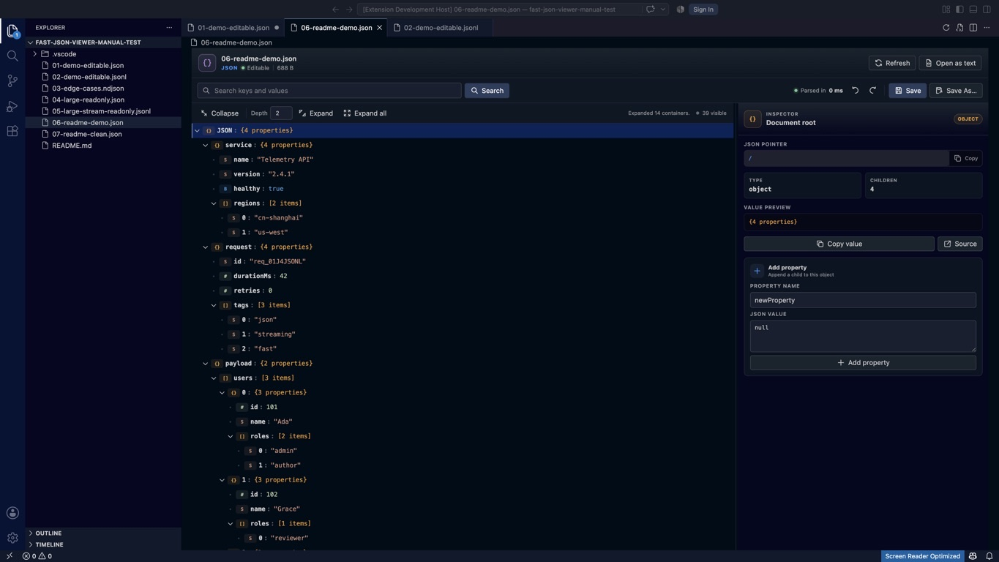
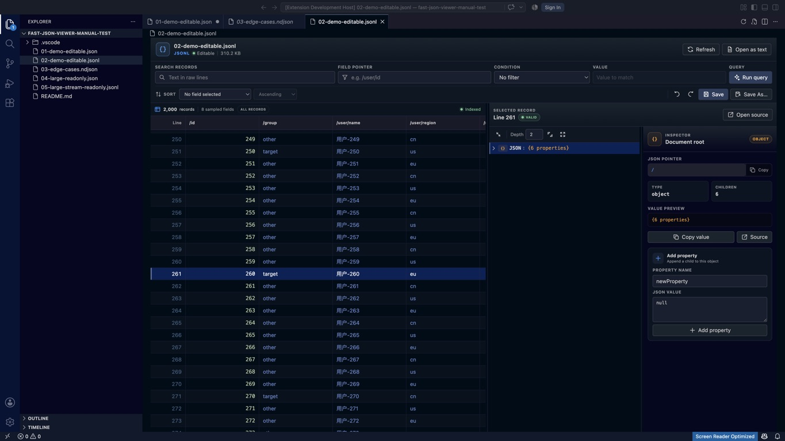

<p align="center">
  
</p>

<h1 align="center">Fast JSON & JSONL Viewer</h1>

<p align="center">
  在 VS Code 里快速读懂 JSON，也能从 GB 级 JSONL / NDJSON 中快速找到那一行。
</p>

<p align="center">
  <a href="https://marketplace.visualstudio.com/items?itemName=daucloud.vscode-json-viewer"></a>
  <a href="https://marketplace.visualstudio.com/items?itemName=daucloud.vscode-json-viewer"></a>
  <a href="https://github.com/daucloud/vscode-json-viewer/actions/workflows/ci.yml"></a>
  <a href="LICENSE"></a>
</p>

<p align="center">MIT License · Desktop / Remote Workspace Extension Host</p>

Fast JSON & JSONL Viewer 是一个为真实数据文件设计的 VS Code 查看器：JSON 用懒加载树和 Inspector 展开，JSONL 用流式虚拟表格浏览。它把解析、索引、过滤和搜索放进隔离 Worker，并用磁盘索引和虚拟化 UI 控制内存与主线程负担。

> 从 [VS Code Marketplace](https://marketplace.visualstudio.com/items?itemName=daucloud.vscode-json-viewer) 安装，或在命令行运行 `code --install-extension daucloud.vscode-json-viewer`。源代码与问题反馈位于 [GitHub](https://github.com/daucloud/vscode-json-viewer)。

## 为什么选择它

| 你正在处理的文件 | Fast JSON & JSONL Viewer 的做法 |
| --- | --- |
| 普通 JSON | 以结构树阅读，按需加载子节点，不必在编辑器里横向滚动一整屏文本 |
| 嵌套很深的 JSON | 通过 JSON Pointer、搜索、展开深度和 Inspector 快速定位 |
| 数百万行 JSONL / NDJSON | 首屏先到，后台顺序扫描并建立磁盘行索引，不把完整文件塞进 Webview |
| 需要修改的小文件 | 在安全大小范围内直接编辑、撤销/重做、Save、Save As 和 Hot Exit |
| 生产环境或不受信任工作区 | 只读文件内容，不执行工作区代码；无网络请求、无遥测 |

## 实际效果

下面是扩展在 VS Code Extension Development Host 中的真实运行截图。

### JSON：懒加载彩色树 + Inspector



树区域只保留当前可见节点；右侧 Inspector 同时展示 JSON Pointer、类型、子节点数量、值预览以及复制、源码定位和编辑入口。

### JSONL：虚拟表格 + 单行 JSON 树



表格同时支持纵向和横向虚拟化。点击记录后，右侧可以像 JSON Viewer 一样展开该行的完整结构；表格/详情和树/Inspector 分隔条都可以拖动。

## 核心能力

### JSON / `.json`

- 懒加载、虚拟化的彩色 JSON 树；对象和数组按页请求子项，单页最多 200 项。
- 搜索键名和值，按深度展开、全部收起，以及带安全上限的 **Expand all**。
- Inspector 显示 JSON Pointer、类型、子节点数量和值预览；支持复制路径、复制值和定位源码。
- 默认不抢占普通 JSON 的打开方式：右键 **Open With → Fast JSON Viewer**，或运行 **Fast JSON Viewer: Open in Fast JSON Viewer**。
- 小文件可编辑：修改值、重命名键、添加/删除节点、撤销/重做、Save、Save As 和 Hot Exit 备份。
- 保留不安全整数的原始字面量，例如 `900719925474099312345` 不会被舍入成近似值。

### JSONL / NDJSON / `.jsonlines`

- 首屏默认读取前 200 条记录（可通过 `jsonl.pageSize` 调整）；后台顺序扫描，建立可复用的磁盘行索引。
- 虚拟化表格支持字段采样、列宽调整、行键盘导航和滚动位置恢复，常驻 DOM 行数保持很小。
- 原始行全文搜索；按 JSON Pointer 进行等于、不等于、包含、比较、存在和空值过滤。
- 查询结果写入临时磁盘索引，支持分页、进度展示和取消，不在内存保存全部命中行。
- 点击行后在详情树中查看完整 JSON；非法 JSON 行独立标红，不会阻断其他记录。
- 超大文件默认只读，源文件不会整体传入扩展宿主或 Webview；检测到外部修改会立即停止旧索引并提示刷新。

### 按文件大小自动选择模式

默认阈值可以在设置中调整；JSONL 的可编辑上限始终不超过 10 MiB。

| 文件类型与大小 | 打开模式 | 行为 |
| --- | --- | --- |
| JSON ≤ 10 MiB | 可编辑 | 完整树 + Inspector 编辑能力 |
| JSON 10–100 MiB | 只读懒加载 | Worker 解析，Webview 只请求当前展开分支 |
| JSON > 100 MiB | 安全预览 | 不构建完整树，显示截断文本、文件信息和“以文本打开”入口 |
| JSONL / NDJSON ≤ 10 MiB | 可编辑流式模式 | 表格、详情树和小文件编辑能力 |
| JSONL / NDJSON > 10 MiB | 只读流式模式 | 先显示首屏，后台建立索引，适合 GB 级文件 |

## 快速开始

### 从 Marketplace 安装

在 VS Code 扩展面板中搜索 **Fast JSON & JSONL Viewer**，或直接运行：

```bash
code --install-extension daucloud.vscode-json-viewer
```

安装后重新加载 VS Code。扩展要求 VS Code `1.95+`，运行在桌面或 Remote Workspace Extension Host；暂不支持 `vscode.dev` Web Extension。

### 从源码打包 VSIX

在仓库根目录执行：

```bash
npm ci
npm run package
```

然后在 VS Code 中安装生成的 `vscode-json-viewer-0.1.0.vsix`（文件名以实际输出为准），或执行：

```bash
code --install-extension ./vscode-json-viewer-0.1.0.vsix
```

### 打开文件

1. `.jsonl`、`.ndjson` 和 `.jsonlines` 默认使用 Fast JSONL Viewer 打开。
2. `.json` 文件右键选择 **Open With → Fast JSON Viewer**，或运行命令 **Fast JSON Viewer: Open in Fast JSON Viewer**。
3. 在 JSONL Viewer 中组合全文搜索、字段过滤和排序；点击记录即可在右侧详情树中继续展开。

JSON Pointer 示例：`/user/id`、`/items/0/name`。属性名中的 `/` 写成 `~1`，`~` 写成 `~0`。

## 命令

可从命令面板（`⌘⇧P` / `Ctrl+Shift+P`）运行：

| 命令 | 用途 |
| --- | --- |
| **Fast JSON Viewer: Open in Fast JSON Viewer** | 将当前 JSON/JSONL 文件交给对应 Viewer |
| **Fast JSON Viewer: Refresh Viewer** | 重新读取文件并重建当前预览/索引 |
| **Fast JSON Viewer: Open as Text** | 使用 VS Code 普通文本编辑器打开 |
| **Fast JSON Viewer: Clear Index Cache** | 清理本地 JSONL 行索引缓存 |

## 设置

设置前缀为 `fastJsonViewer`。大小单位为 MiB。

| 设置 | 默认值 | 说明 |
| --- | ---: | --- |
| `fastJsonViewer.editableMaxMB` | `10` | 可编辑文件上限；JSONL/NDJSON 还受硬性 10 MiB 上限约束 |
| `fastJsonViewer.maxJsonMB` | `100` | 构建完整 JSON 懒加载树的最大文件大小；更大文件使用安全预览 |
| `fastJsonViewer.jsonl.pageSize` | `200` | 单次请求的最大 JSONL 记录数 |
| `fastJsonViewer.jsonl.schemaSampleRows` | `1000` | 自动发现 JSONL 表格列时采样的记录数 |
| `fastJsonViewer.jsonl.maxLineMB` | `16` | 单条记录完整解析上限；更长记录显示为截断行 |
| `fastJsonViewer.jsonl.sortMaxRows` | `1000000` | 启用全局字段排序的最大结果数；更大文件建议先过滤 |
| `fastJsonViewer.indexCacheMB` | `1024` | 持久化 JSONL 行索引的 LRU 上限；不会缓存源文件内容 |

## 性能设计与实测

性能优先级从架构开始落实：

- 解析、行索引、过滤、搜索和排序均在隔离 `worker_threads` 中执行；Worker 崩溃只降级当前预览。
- Worker 设置了 V8 内存上限；Webview 与 Worker 的单次消息约束在 1 MiB 内。
- JSON 树按 JSON Pointer 懒加载；JSONL 采用块索引、变长行长编码和临时结果索引。
- TanStack Virtual 只挂载可见行/列；搜索或过滤取消时，界面先立即解除等待，再让 Worker 协作收尾。
- 读取、索引和保存前后都会校验文件大小、mtime 及首尾块指纹，避免展示过期结果或覆盖外部修改。

以下是本机 Apple Silicon、Node 22、本地 SSD 的门禁样本（2026-07-28；结果会随硬件、文件形状和系统负载变化）：

| 场景 | 实测结果 |
| --- | ---: |
| 100 MiB JSONL 首屏 | `73.5 ms` |
| 100 MiB JSONL 行索引 | `75.3 ms` |
| 100 MiB JSONL 字段过滤 | `624.2 ms` · `160.2 MB/s` |
| 查询取消响应 | `5.0 ms` |
| 100 MiB JSONL 进程 RSS | `253.4 MB` |
| 100 MiB JSON 根节点可用 | `586.8 ms` |
| 100 MiB JSON 场景峰值 RSS | `632.1 MB` |
| 1 GiB JSONL 首屏 | `26.9 ms` |
| 1 GiB JSONL 字段过滤 | `4.122 s` · `248.4 MB/s` |
| 1 GiB JSONL Worker heap + external | `40.3 MB` |

在本地复现：

```bash
npm run benchmark       # 100 MiB 门禁
npm run benchmark:10gb  # 本地/定期 10 GiB 流式测试
```

基准文件写入系统临时目录，结束或中断时会清理。

## 兼容性、安全与已知限制

- 支持 UTF-8（含 BOM）、LF/CRLF、末行无换行、空行、非法 JSONL 单行、超长记录和多字节字符。
- 严格使用 JSON 语法解析；JSONL 中坏行单独显示，不会让整份文件失效。
- 扩展不发送网络请求、不包含遥测，所有文件内容按纯文本处理，并使用严格 CSP 的 Webview。
- 支持 VS Code 不受信任工作区：Viewer 不执行任务、调试配置或工作区代码。
- 仅支持桌面/Remote Workspace Extension Host，不支持 `vscode.dev` Web Extension。
- 暂不提供 JMESPath；全局排序会消耗与结果数成正比的资源，超过上限时请先过滤。
- 非本地/非远程原生文件系统若无法提供可流式读取的文件描述符，大文件可能退化为安全文本预览。

## 开发与验证

依赖已经存在时不需要重复安装；首次准备工作区或锁文件更新后再执行 `npm ci`。

```bash
npm ci
npm run check          # TypeScript 类型检查
npm test               # 单元测试
npm run test:vscode    # VS Code 集成测试
npm run build          # 构建扩展与 Worker
npm run package        # 检查、测试、构建并打包 VSIX
```

测试覆盖 JSON Pointer、懒子树分页、复制预算、消息大小门禁、任意精度数字比较、行索引、跨块换行、多字节 UTF-8、BOM、空/坏/超长记录、字段过滤、排序上限、缓存失效、外部修改、取消旧查询和 Webview 状态恢复。CI 在 macOS、Windows、Linux 执行类型检查、测试、构建和 VSIX 打包，并在 Linux 执行 100 MiB 性能门禁；10 GiB 基准按计划运行。

## 项目与反馈

- [VS Code Marketplace](https://marketplace.visualstudio.com/items?itemName=daucloud.vscode-json-viewer)
- [GitHub 仓库](https://github.com/daucloud/vscode-json-viewer)
- [问题与建议](https://github.com/daucloud/vscode-json-viewer/issues)
- [贡献指南](https://github.com/daucloud/vscode-json-viewer/blob/main/CONTRIBUTING.md)
- [安全策略](https://github.com/daucloud/vscode-json-viewer/blob/main/SECURITY.md)
- 维护者发布流程：`docs/RELEASE.md`

## License

[MIT](LICENSE)
